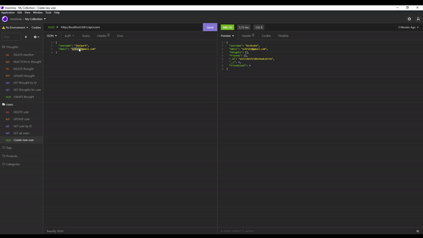
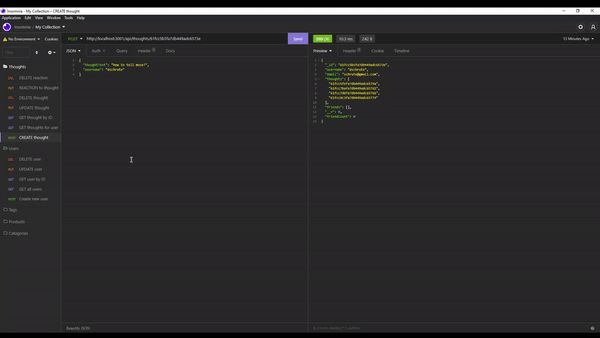
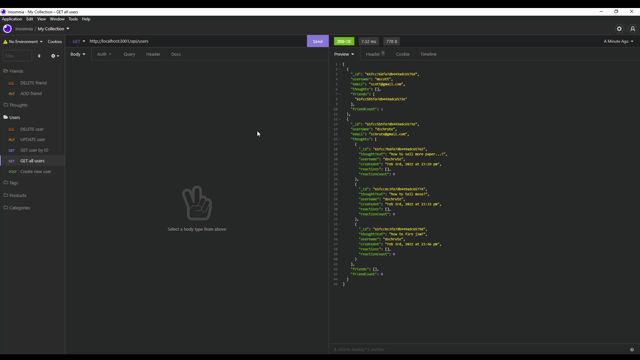

<h1 align='center'> Social Network API 🔗 </h1>
  

  
  
  

    
    
    
    

     
  ## Description 🗺️
   An API for a social network web application where users can share their thoughts, react to friends' thoughts, and create a friend list. Videos of the functionality can be found [here](./images) tested using Insomnia. GIFs are below! 

   

    
    
    
  

  ## Table of Contents
  - [Description](#description)
  - [Usage](#usage)
  - [Contributing](#contributing)
  - [Questions](#questions)

  ## Usage 🎛️
  Run the following command at the file root:

  `npm i`

  After files complete download, run the following:

  `npm start`

  ## Contributing 👨‍💻
  Calvin Donner

  ## GitHub :octocat:
  [Calvin Donner](https://github.com/calvinjdonner)

  ## Questions ❓
  Please email me with any questions at: calvinjdonner@gmail.com 
 
